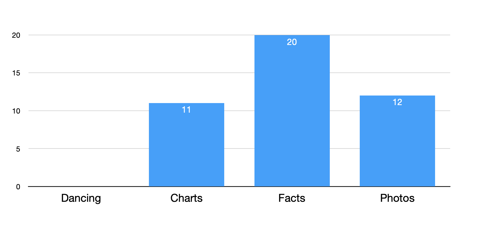
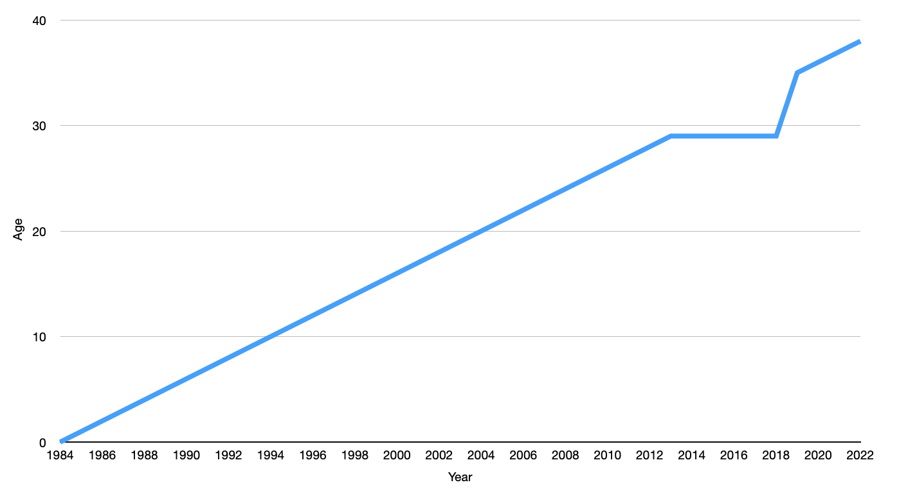
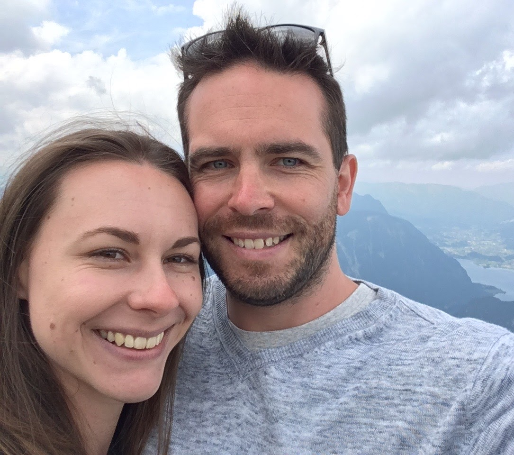

<!-- I was going to explain my life through interpretive dance  -->
<!-- Then I remember that I'm a terrible dancer but I came up with a more exciting format  -->

---

# My life through charts, graphs and facts

<!-- So here is my life through charts and facts and some photos to fill in the gaps -->

---

# Born 1984

<!-- Let's start back at 1984. I was born and there was much rejoicing -->

---

# Age

<!-- Since that point I aged farily predictably until I had an existential crisis about turning 30 and held that off for a few years -->
<!-- Which meant quite a few 29th birthday parties -->
<!-- As I'm nearing 40 with official designation of middle aged this may play out again -->

---

# Alex~~ander~~ Skorulis

<!-- My parents named me Alexander. which is a name that is only used on legal documents and by substitute teachers reading the class roll -->
<!-- So over the years I've been given a lot of other names --> 
<!-- Most people stick with the shorter form Alex --> 
<!-- You can see during adolescant years screwloose got a lot of use --> 
<!-- Here different friends tried out a lot of options --> 
<!-- And in the end everyone just picked either my first or last name --> 

---

# Skorulis

<!-- I get asked a lot if I'm Greek when people see my last name, but it's actually Lithuanian --> 
<!-- I once asked my Dad about learning the language but he said that would be a useless endeavor since when would I ever need it? --> 

---

# Obligatory childhood photos

<!-- I don't remember much about my early years but photographic evidence shows that I had impeccable dress sense and an atrocious bowl cut -->

---

# Moved to Young

* Population 10000
* Cherry capital of Australia
* 4 hours drive from Sydney

<!-- When I was 7 my family moved from Sydney to Young and I spent the rest of my childhood there up until the end of high school -->
<!-- You can see the colonial motel on this map which my parents purchased and we also lived at -->

---

# Computers

* First computer was a 386 with 2MB ram
* Fascinated by computers from an early age

<!-- I've always enjoyed computers, mostly for playing games but never really thought of it as a career until I picked my uni course --> 
<!-- Though back in the day getting something to run required constant fiddling with DOS boot scripts -->
<!-- To this day I still hate config files -->

---

# Computer purchases

<!-- There was a time when I was buying new PCs to play the latest games -->
<!-- Since I started doing iOS work I've been buying macs instead and the options for games are pretty slim so I wouldn't really consider myself a gamer these days -->

---

# Sydney university

* Found my love of programming
* Lots of time spent in CS labs

<!-- Even though I spent a lot of my childhood sitting in front of a computer I never really thought of it as a career until the end of high school -->
<!-- I completed a bachelor of computer science at Sydney Uni -->
<!-- I was never that interested in uni from the academic side and would quite often skip lectures to spend time in the computer labs coding something that was in my head -->

---

# Assetinsure

* 2006 - 2009
* Writing custom business insurance software
* Windows client connecting to a shared SQL database
* Tech stack: C# winforms + UML + SQL

<!-- After uni I started my career in software development at AssetInsure -->
<!-- My boss would always say that business knowledge was far more important than the technical side -->
<!-- But this was due to developers also working as business analysts, testers and tech support -->
<!-- Numerous times I had to explain not just how to use the software but also how people's own job worked  -->

---

# Europe 2009

* 5 months
* 16 countries
* Mostly solo
* 7.6L beer a day at oktoberfest

<!-- At some point I realised that there wasn't much point working and saving forever so I quit to go travelling -->
<!-- I found out that I really like solo travelling where I just get up and decide what to do each day -->

---

<!-- As with any 20s doing a Europe trip, I spent a lot of time having fun at festivals and soaking in the culture of old churches -->
<!-- But all good things must come to an end and I went back to Sydney to find a new job -->

---

# Mirror image access

* 2009 - 2011
* Mobile web company moving into apps
* Mobile design agency
* Lots of small projects
* Started as the sole non web developer

<!-- That was harder than expected as my previous experience was worth nothing in a world moving towards web based apps -->
<!-- Luckily I met someone who managed a mobile development company and was looking to move into iOS but there weren't any devs out there at the time -->
<!-- At the time there really weren't any developers around so they were happy for me to pick it up on the job -->
<!-- Probably the most critical change in my career and it only happened by chance -->

---

# Europe 2011

* 3 months
* 18 countries

<!-- And then I got bored again but this time decided to move to London instead of just a holiday -->
<!-- But wasn't really sure what to do after I landed in London so figured a summer holiday was a good idea -->

---

# London

* 2011 - 2014
* Started specialisation in iOS
* Didn't see much of England

<!-- I managed to continue working on iOS in London, but all of my friends were working in bars -->
<!-- So I both earned decent money and almost never paid for drinks -->

---

# Big album of beers

Black Sheep Ale. 4.4%
Black and average. 2/10
http://bigalbumofbeers.com/

<!-- One day I took a photo of a beer gave it a rating and decided I was going to do this from now on  -->
<!-- As you can see, my reviews are not necessarily in depth. I don't have a great sense of taste -->
<!-- It became a habit to always choose any beer I hadn't had before -->
<!-- I called this the big album of beers -->
<!-- Started as a facebook album and now also exists as a website -->
<!-- For any craft beer drinkers asking why I don't just use Untappd, my mobile provider in London blocked it -->

---

# Big album of beers

<!--It's been my longest ever project and still continues. Over 2200 unique beers so far -->

---

# I don't like cars

* I have a drivers licence
* I've never owned a car
* I haven't driven a car in over 10 years 

---

<!-- Given what you've seen up until now you might think that it's because of this Ricky gervais quote  -->

---

# I love walking and running

* I am that friend who will always try to walk home
* City to surf 5 times (PB 1:06:39)
* 1 marathon (4:07:44)
* Most distance running is 300km in 1 month

<!-- But actually I just much prefer to get around on my own feet  -->
<!-- I always run in my trusty volleys -->
<!-- If something is a bit too far to walk, running is a good option -->

---

# Pub crawls

<!-- If you take the 2 common themes here it should be no surprise that I love a pub crawl which combines both walking and drinking  -->
<!-- These are not a leisurely stroll, you can't just hope to visit 26 pubs in a day like on the circle line pub crawl.  -->
<!-- It requires a highly regimented schedule and a lot of dicipline to keep a group of drunks moving -->

---

# Got married

* Met in 2012
* Propsed in Austria
* Married in 2019 in the Blue Mountains

<!-- During my stay in London I met my now wife Amy. -->
<!-- She was working in the same bar at most of my friends and was the only person who did not give me free drinks -->
<!-- Her visa was expiring so we moved back to Sydney in 2014 -->

---

# Homebrewing

* Started 2016
* 48 batches so far
* Tiny batches, 5L - 7L
* First beer to run out at my wedding
* Always all grain

<!-- One of non computer based hobbies is brewing beer -->
<!-- I don't use kits but start from bags of grain and cook it up on my stovetop -->
<!-- Overall it's a lot of work for what I get out of it -->

---

# Bouldering

* Started this year
* 5 venues withing walking distance of my house

<!-- It's a new sport for me which I like because I can do it on my own schedule -->
<!-- I'm pretty terrible but I often get through by brute force -->

---

# Last week

* 5 days in Queenstown
* 3 days snowboarding
* Still in pain

<!-- I just got back this week from a snowboarding trip to queenstown. Which makes it sound like a common thing, but really it's the first time in a decade -->
<!-- Like bouldering, I'm completely ungraceful with terrible technique but I push myself and learn through failure -->
<!-- And that's everything up to date  -->

---